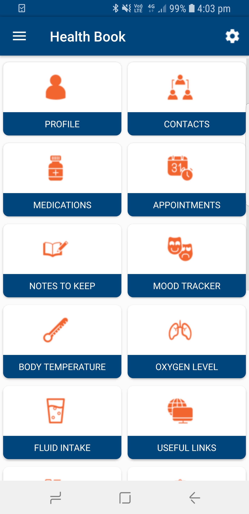

# Health Book
Health Book is a free and non-profitable app designed to support and empower patients along their cancer journey. Health Book is a refreshing change from apps that offer clinical resources and medical information. Health Book is created as a useful app to support patients wellbeing and help them manage their routine. An easy-to-use app that will reduce unnecessary stress during stressful times. This app helps manage personal information, appointments, contacts, notes, medicines, mood, body temprature, fluid intake, oxygen level and lists. 

## Table of contents
* [General info](#general-info)
* [Screenshots](#screenshots)
* [Technologies](#technologies)
* [Setup](#setup)
* [Features](#features)
* [Inspiration](#inspiration)
* [Contact](#contact)

## General info
You can download this app from [@GenieCanHelp](http://geniecanhelpapp.com/) website. 
This folder contains the source code of GenieCanHelp Android Mobile application. If you want to contribute to this app visit [@Contribution Guide](https://github.com/CyberGenieSolutions/GenieCancerHelpAndroidApp/blob/master/CODE_OF_CONDUCT.md). 

## Screenshots

## Technologies
* Targeted for sdk version 26

## Setup
Clone or Download GenieCanHelp source code and developers need to open this project in Android Studio.

## Features
List of existing features. You can find details of every feature [@Functional Specification document](https://github.com/CyberGenieSolutions/GenieCancerHelpAndroidApp/blob/master/docs/GenieCanHelp_Functional_Specification.pdf)
* keep personal information
* Add or remove features from the main menu
* keep contacts
* Manage Appointments with reminders
* Manage Medications with reminders
* Mood tracker
* Body temprature record
* Keep notes
* Keep lists
* Oxygen level
* Fluid intake
* Useful links
* Create PDF reports
* Email reports

To-do list:
* Sleep tracker
* Blood pressure record
* Finding nearest toilets
* Finding nearest playgrounds
* Audio dairy
* Ability to audio record doctor's appointment
* Ability to add or capture photo of medicine in medicine record

## Inspiration
This project was initiated to help patients in their difficult time. Focus of this app is the wellbeing of people dealing with cancer. I would like to thank GenieCanHelp team for putting many many hours of volunteer work in this project! 

## Contact
Created by [@CyberGenieSolutions](http://www.cybergeniesolutions.com/)
